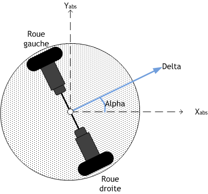

# ChallengeTuxae2024  
Cette année 2024 marque la première participation de l'ENSAE à la coupe de France de Robotique et Eurobot. Une compétition de création de robot se déplaçant sur un plateau de jeu de 3m de long et 2m de large.  

# Introduction
Afin d'organiser un Challenge Tuxae en lien avec des problématiques réelles, nous vous proposons d'utiliser l'informatique, les stats et le machine learning pour repérer le robot sur le plateau de jeu. C'est à dire que l'objectif est d'estimer les trois valeurs $(x, y, \alpha)$ avec $x$ et $y$ les coordonnées du robot dans le plan et $\alpha$ l'orientation selon l'axe $z$ du robot (en prenant pour orientation nul l'axe $x$ et en tournant dans le sens trigonométrique).  

C'est un challenge à plusieurs niveaux, vous pouvez commencer avec vos connaissances de physique de Terminal en intégrant deux fois les valeurs d'accélération du robot mesurées par l'accéléromètre et vous pourrez vous retrouvez à faire de la Computer Vision afin de réaliser de la triangulation.  

# Sur le robot
Le robot est une base différentielle, c'est à dire munie de deux roues motrices indépendantes. Pour aller tout droit les deux roues tournent dans le même sens à la même vitesse et pour tourner les roues tournent à vitesse différentes ou dans le sens opposé.  
Le robot est muni de moteur pas à pas [en apprendre plus sur les moteurs pas à pas](https://youtu.be/eyqwLiowZiU?si=CtTXujWScu991Usb). Ce sont des moteurs pour lequels nous pouvons controller la rotation pas par pas (1 pas = 1.8° soit 200 pas pour un tour entier).  
Le robot est également muni d'un accéléromètre donnant l'accélération instantanée selon les 3 axes de l'espace. En intégrant deux fois l'accélération instantanée, on peut estimer le déplacement du robot durant le temps $\Delta t = 1 seconde$.  
Le robot est muni d'un gyroscope placé à l'horizontal donnant la vitesse angulaire selon les 3 axes de l'espace. En intégrant la vitesse angulaire selon l'axe $z$ on obtient une estimation du déplacement angulaire.   
Le robot est également muni d'une caméra embarquée donnant des images de ce que le robot voit au temps $t$. Le traitement d'image peut se faire via des méthodes "simple" de computer vision [Scale-invariant feature transform](https://fr.wikipedia.org/wiki/Scale-invariant_feature_transform) ou des méthodes de machine learning comme avec Yolov8 en repérant des objets caractéristiques du plateau [Yolov8]()

# Comment organiser ce challenge Tuxae
On peut simuler le robot sur pybullet. Créer un déplacement du robot sur 100 secondes et réaliser une mesure instantanée à chaque seconde {0, 1, ..., 99, 100}. On obtient alors les variables d'entrées :  
temps (t), vit_x, vit_y, vit_angle_z, rot_gauche, rot_droit, nom_image    

Et en sortie on cherche à trouver :  
x, y, $\alpha$

# Message
[Tuxae][Challenge2024]

Bonjour à tous,

Nous espérons que vous avez passé de bonnes vacances ! Pour reprendre en douceur, nous lancons le Challenge Tuxae 2024. Le défi est disponible sur Kaggle en suivant ce lien : https://www.kaggle.com/competitions/challenge-tuxae-2024

L'objectif est d'estimer les coordonnées et l'orientation d'un robot à partir de données provenant de capteurs embarquées et de photos prises par le robot. Vous avez jusqu'au mercredi 13 mars pour soumettre vos prédictions. Les étudiants ENSAE sur le podium seront récompensés par des lots incroyables.

Bon courage à tous.

C'est également l'occasion de parler, pour les 1A et 2AD, de la passation Tuxae, l'association d'informatique et de robotique de l'école. Nous organisons des ateliers et des défis autour du monde informatique pour les étudiants de l'ENSAE. Si vous êtes intéressé pour rejoindre l'association ou simplement pour en savoir plus, n'hésitez pas à me contacter.

